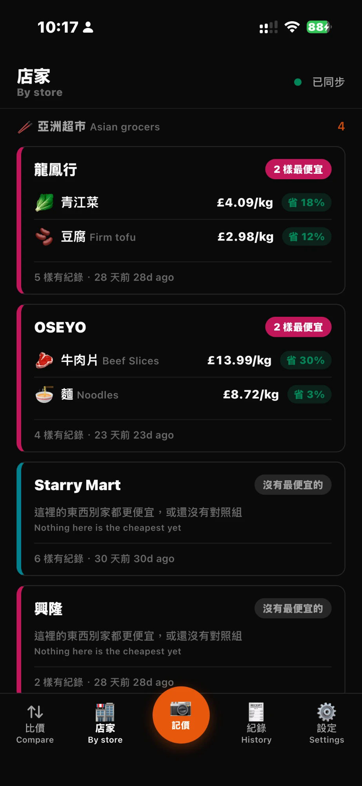
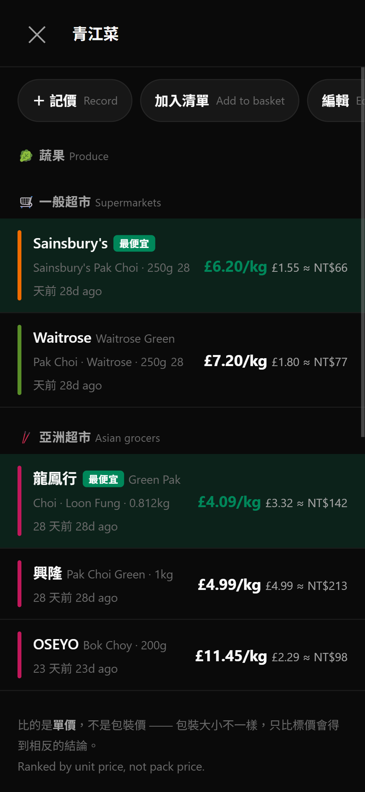
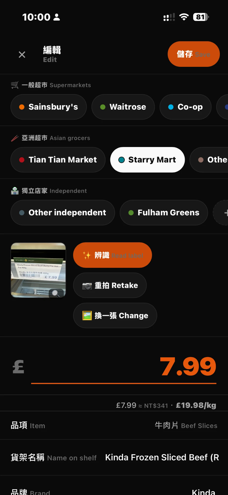
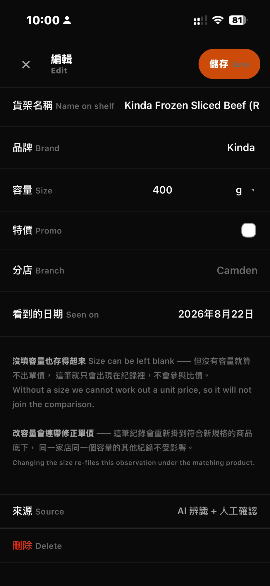

# price-check: UK supermarket price tracker

Photograph a shelf label and see which shop sells that item cheapest, and where this week's basket costs least.
Log prices on the phone, review them on a laptop; it works offline.

**Runs on** Cloudflare Workers + D1 + R2 + Workers AI. Deployed on my own domain for personal use (single user, password-protected), so there is no public demo; the screenshots below are from the live app.

*The UI pairs Chinese with English because I built it for my own use: Chinese says what an item is, English matches the shelf label. Key screens are annotated in English below.*

<table>
<tr>
<td width="50%" valign="top"><br>
<sub><b>Shops.</b> Each card lists what that shop is cheapest for, and how much you save versus the next-cheapest shop in the same group.</sub></td>
<td width="50%" valign="top"><br>
<sub><b>One item, ranked by unit price.</b> Supermarkets and Asian grocers are ranked separately, so each group has its own cheapest.</sub></td>
</tr>
<tr>
<td width="50%" valign="top"><br>
<sub><b>From a shelf-label photo.</b> AI reads price, pack size and name into the form; unit price (£/kg) and an approximate TWD figure update as you type.</sub></td>
<td width="50%" valign="top"><br>
<sub><b>Nothing is saved unchecked.</b> The rest of the form stays editable, and the record is marked as AI-read and confirmed by me.</sub></td>
</tr>
</table>

---

## Why build it

Existing apps (MyGroceryPal, Compare the Trolley) scrape each chain's **online prices**. They cover the main chains and are worth installing as a baseline. What they can't cover:

- **In-store-only prices**: Aldi and Lidl Specialbuys, Co-op yellow stickers, one-branch discounts
- **Your own idea of "the same thing"**: no database knows you treat Sainsbury's own-brand and Aldi's own-brand as interchangeable
- **Offline use**: supermarkets often have no signal, and price logging happens standing at the shelf

So this is a **complement**, not a replacement.

---

## How the data is organised: three levels

```
items      the "same thing" in my head          Whole Milk
  └ products  a specific product at a shop      Aldi · Cowbelle 2L
      └ prices   a price seen on a given day    2026-08-21 · £1.45
```

**Without these levels, comparison is impossible.** Aldi sells 2L for £1.45 and Waitrose 1.13L for £1.35, so comparing shelf prices gives the wrong answer. £0.73/L vs £1.19/L is the truth, and getting there requires knowing that both are "the same thing" and how big each one is.

An item's **unit basis** (weight, volume or count) drives every conversion. Choose "volume" and everything is converted per litre; from then on only ml or L can be entered for that item, so a 500g milk entry can't slip in and break the comparison.

---

## Three non-negotiable rules

**1. Prices are stored as whole pence.** £1.45 is stored as `145`. Basket comparison adds and sorts a lot of numbers, and floating-point error will lie outright when the gap is "3p in total". Unit prices (145 ÷ 2000ml) are fractions by nature, so they stay floating-point and are only rounded for display and final totals.

**2. Missing data is never filled in.** When a shop is missing an item, its price is not borrowed from another shop or treated as zero. Rankings compare **coverage** first, then total, and list what's missing. Quietly filling gaps would make the shop with the least data always look cheapest, which is exactly backwards.

**3. AI only suggests.** Label-reading results always go into a form for you to check; they are never written straight to the database. A wrong price is worse than no price: it contaminates every later comparison, and you won't notice.

Also, **prices go stale**. Every price records its local date, the UI always shows "seen N days ago", and anything older than 30 days is greyed out and marked "out of date". UK food prices move fast; comparing against a three-month-old number is guessing.

---

## Chinese and English side by side

I live in the UK but think in Chinese, so both languages have to be there: Chinese says what the thing is, English says how to find it in the shop or search for it online.

- **Data**: items have `name_zh` / `name_en`; products also store the English name printed on the shelf
- **Interface**: Chinese at the main size, English one size smaller in the `--faint` colour beside it
- **Exception**: shop names always use the original English brand. They should look exactly like the sign outside; a Chinese transliteration of "Sainsbury's" wouldn't match anything in the shop

---

## Photos: three sources

| Source | When to use it |
|---|---|
| 📷 **Take photo** | You're standing at the shelf. Opens the rear camera directly |
| 🖼 **Choose photo** | Already taken; pick one from the gallery |
| 📚 **Batch import** | A pile of photos; select them all and confirm one by one |

**Batch import is the main flow**: photograph every label in the shop in one go, then import them all at home. Each photo is read automatically and opens a pre-filled form; you confirm, pick the item and save, and it jumps straight to the next one without going back to the list. Unreadable or duplicate photos can be skipped.

The queue is stored in IndexedDB, not just in memory: if the phone kills the app at photo 12 of 20, it asks whether to carry on when you come back. Settings always shows "N left".

**The `capture` attribute is the key detail.** `<input type="file" accept="image/*" capture="environment">` **opens the camera directly** on a phone, so the photos already in the gallery can never be chosen; that was the problem in the first version. Now only "Take photo" uses `capture`, and the other two don't, so iOS shows its "Photo Library / Take Photo / Browse" menu.

---

## Shops in three groups

**Price rankings and basket totals are calculated per group, and each group gets its own cheapest shop**:

| Group | Shops |
|---|---|
| 🛒 Supermarkets | Sainsbury's · Waitrose · Co-op · Aldi · Lidl · Tesco · Asda · Morrisons · M&S · Iceland · Ocado · Other |
| 🥢 Asian supermarkets | Tian Tian Market · Starry Mart · Other Asian |
| 🏪 Independents | Greengrocers, butchers, market stalls, farm shops, Turkish / Middle Eastern grocers… (almost all added by the user; the only built-in one is "Other independent" for shops with no name) |

**Why separate them.** These groups don't compete on the same shelf: you can't buy soy sauce at Aldi, nobody makes a trip to an Asian supermarket for milk, and the greengrocer on the corner sells only a dozen things but is often cheapest. Mixing them produces two useless conclusions:

- Single item: "Tian Tian's milk costs more than Aldi's": true, but not an option you'd ever consider
- Basket total: shops that stock only a few items always come last because they're missing so much

Grouping matches how shopping actually works (everyday items at Aldi, Asian ingredients at Tian Tian, vegetables from the greengrocer on the way), and the tool follows that reality.

Adding a fourth group takes one row in `GROUPS` in `stores.js`: rankings, baskets, the shop row and the shop editor's dropdown all follow it.

An item with data in only one group (soy sauce, say) shows no group heading; it would just be noise.

### Adding your own shops

The Asian grocer on the corner, a market stall, a one-off small supermarket: these are often the cheapest places, and not being on the list shouldn't stop you logging them. **Each group has a `＋` at the end of its row when logging a price**; add the shop on the spot and it's selected automatically when saved (you're standing in it). Shops can also be managed from Settings → Shops.

A custom shop has a group (who it's compared against), a colour (used in trend charts and rankings) and a note (which branch).

**Built-in chains live in `public/stores.js`; custom shops live in D1.** The first almost never changes, so syncing it would be wasted work and would make every device wait for sync before shops appeared. The second only you know about, so **it must sync along with the prices**, or another device would show those prices with no shop name.

Deleting a shop that still has prices asks first, because those prices would lose their shop. To just hide a shop from the menus, archive it instead; its prices still count in comparisons.

---

## Editing what's already saved

**Every level of data can be edited**:

| What | Where |
|---|---|
| Item (Chinese and English names, category) | Item detail → Edit |
| Product (shelf name, brand, size, unit) | Tap a ranking row or history row → edit form |
| Price record (amount, date, shop, offer, branch) | Same as above |

Editing uses **the same form as logging**, not a separate screen. Two forms with the same fields would drift apart sooner or later (validation added to one and not the other).

**Ranking rows are tappable.** When you see an obviously wrong number like "rice 1.9p/kg", your first reaction is to tap it; you shouldn't have to scroll to the history list at the bottom to find a way in.

**Changing the size fixes the unit price without disturbing other records.** The record is re-attached to the product matching the new size (the same find-or-create rule used when logging), and the old product is soft-deleted if it has no prices left. Changing shop or item works the same way.

**The AI doesn't run automatically when editing.** Reopening a record with a photo keeps the photo but doesn't re-read it, because that would overwrite the value you're correcting with the AI's guess. Press "Read label" to re-run it yourself.

**The unit basis locks once an item has products.** Every product's `size_unit` was entered against it; switching g to ml would treat 500g as 500ml and silently corrupt every unit price. To change it, delete the item and recreate it.

---

## TWD conversion

Prices show an `≈ NT$` figure alongside, so they can be compared with prices back home. It can be turned off in Settings.

**Deliberately the opposite of travel-money: rates are not frozen here.** travel-money freezes the rate on each entry, because it is a ledger and "how much did this trip cost in TWD" must be a fixed number that reconciles. Here the question is "is this soy sauce expensive", where a three-month-old rate just gets in the way, so the latest rate is always used.

**TWD is always a reference value**: it is marked `≈`, never used in any sorting or totals, and the truth of any comparison is always the sterling column. Amounts also deliberately have no decimals (NT$57.83 is false precision) and are rounded to tens above a thousand.

The Worker fetches the rate once a day at 01:30 UTC (fawazahmed0, falling back to er-api). It reaches the client along with sync and is stored in IndexedDB; offline, the last copy is used, and being a few days old doesn't change whether something is expensive.

---

## Home: search → tap a name → tick a basket

"Compare" and "List" used to be two pages, but they were two halves of the same job: both listed items. Keeping them apart meant finding something on the compare page, remembering it, then adding it again on the list page. Now it's one page:

- **Search** by Chinese, English, shelf name or brand
- **Tap a name** → which shop sells it cheapest (per-group ranking, trend, every record)
- **Tap the circle on the left** → add to the basket; ticked items float to the top, with the totals panel right above them

The basket panel keeps the same logic (per-group totals, coverage first, no filled-in data). Quantity adjustments are tucked into a collapsible "Adjust quantities" section, because most of the time you only want the total.

The tabs are now **Compare · Shops · Log · History · Settings**. The new "🧾 History" lists every price observation, newest first, and tapping one opens it for editing. To fix a mistyped price you usually remember "the one I just entered", not which item it belongs to.

---

## Shops page: what's worth buying here

The home page answers "which shop sells this cheapest". **The shops page answers the reverse question**: I'm in Aldi, what's worth buying here?

**The card itself answers the question**, rather than showing a number you have to tap into. When you're scrolling on your phone at the shop door, every extra tap is a distraction. The three best deals (biggest saving first) are printed right on the card:

```
▌ Aldi                                    Cheapest for 4
▌ 🍚 Rice               £1.09/kg   save 50%
▌ 🍞 Sliced Bread        94p/kg    save 44%
▌ 🥛 Whole Milk          73p/L     save 39%
▌ 1 more · 4 items recorded · today
```

A shop that wins nothing doesn't pretend otherwise: the badge turns grey and says "cheapest for nothing".

Tap a card for the full list, split into three parts:

| | |
|---|---|
| 🥇 Best bought here | Sliced bread 94p/kg **save 44%** (vs Waitrose) |
| 🧭 Only recorded here | Eggs 35p each: nothing to compare against, so it doesn't count as a win |
| 💸 Don't buy here | Sliced bread £1.69/kg **80% more** (vs Aldi) |

**"Only recorded here" deliberately doesn't count as a win.** Being the only shop with a record doesn't mean it's cheap, only that nobody has logged the same thing elsewhere. Counting it as a win would make you think the shop is good value.

Percentages compare **unit prices**, and only **within the same group** (see the grouping rationale above). A win is compared with second place (how much you save); a loss is compared with first place (how much more you pay).

This page replaced the old "Items" tab. The home page already lists and searches every item, so the `＋` for adding an item moved to the top right of the home page.

---

## Photo zoom

Shelf-label text is small, and a 96px thumbnail can't show the price, which is the only reason the photo exists. Thumbnails on the log and edit screens now open full-screen; tap again to zoom to 2.5× and pan. The phone's back button closes only the viewer and leaves the edit screen open.

---

## Item icons

Emoji used to be tied to categories, so "apple" and "bok choy" both got 🥬 and "eggs" got 🥛. There are only a dozen or so categories but hundreds of things you buy, so a one-to-one mapping never fits.

Now there are three levels, checked top down:

1. **Your own pick** (Item edit → Icon, 95 common foods in 8 groups)
2. **Guessed from the name**: the Chinese and English keyword table in `public/emoji.js`
3. **The category's icon**, only if neither of the above applies

Existing items improve with no migration, because their `emoji` field is empty and falls through to level 2.

Settings → **Tidy categories and icons** re-checks each item's category from its name, lists the mismatches and lets you tick them one by one. **Nothing changes automatically**: categories are your judgement, not the tool's (eggs sit in the dairy aisle in UK supermarkets, and tofu could reasonably be a staple or a protein). A new "Condiments" category was added at the same time.

---

## Export

Settings → Export, in two formats:

**Excel (.xlsx)** with three sheets:

| Sheet | Contents |
|---|---|
| Comparison | One row per item, one column per shop, unit prices in the cells; plus the cheapest shop and the biggest price gap |
| Prices | Every observation as a log, 18 columns including type, offer, branch and source |
| Items | The item list with each item's product count, observation count and last update |

**CSV** contains only the price log, in UTF-8 **with a BOM**; without it, Excel opens the file in the system's ANSI encoding and all the Chinese turns into garbage.

No SheetJS. An xlsx file is just a zip of a few XML files, and packing it "stored" (method 0, uncompressed) is entirely valid. `public/export.js` is under 200 lines in total, a better deal than pulling in an 800KB library. The comparison logic isn't rewritten in export.js: `rankItem` is passed in from app.js, so exported numbers can never disagree with what's on screen.

---

## Label reading

UK shelf labels already print the product name, the price and a unit price (`£/kg` or `£/100g`), so the information is complete.

It uses Cloudflare Workers AI (free tier: 10,000 Neurons a day). `src/extract.js` wraps it in a single function, `extractLabel()`, so the provider can change without touching the callers.

**Tested on 2026-08-21** (a synthetic Sainsbury's label: name / 2.27L / £1.65 / 72.7p per litre):

| Alias | Model | Time | Result |
|---|---|---|---|
| `scout` | `@cf/meta/llama-4-scout-17b-16e-instruct` | **1.3s** | All correct ← default |
| `qwen` | `@cf/qwen/qwen3.8-27b` | 3.1s | All correct |
| `gemma` | `@cf/google/gemma-4-26b-a4b-it` | 10.1s | All correct |

All three read it correctly and differed only in speed, so the fastest was chosen. Waiting 10 seconds at a shelf is not acceptable.

Models that "think" first, like `gemma`, need a generous `max_tokens`: at 512 the reasoning uses up the budget and the answer is cut off before a word is written (`finish_reason: length`, empty `content`). It is now 2048.

Not included: `moondream3.1` (on this account it only returned `{}` in 186ms, with no inference run) and `llama-3.2-vision` (requires manually accepting a licence and is restricted for EU users).

**Settings → Model comparison** runs all three models on a real photo side by side, so you can judge accuracy by eye. Accuracy on real shelf photos hasn't been measured yet: the test above used a synthetic image with clean type and no glare or angle.

---

## Development

```bash
npm install
cp .dev.vars.example .dev.vars      # set APP_PASSWORD
npx wrangler d1 execute price-check --local --file=./schema.sql
npm run dev
```

**If a change under `public/` doesn't show up, suspect the service worker first.** It is cache-first (the price of instant offline launch), so the browser serves the old version and updates in the background. When testing, clearing it is fastest:

```js
for (const r of await navigator.serviceWorker.getRegistrations()) await r.unregister();
for (const k of await caches.keys()) await caches.delete(k);
location.reload();
```

Filling the cache manually with `fetch(url, {cache:"reload"})` **does not work**: that request is intercepted by the service worker too, which returns the old copy, writing the old file back into the cache.

When the list of files under `public/` changes, update the `SHELL` array in `sw.js` and bump `VERSION`.

---

## Deployment

```bash
npx wrangler d1 create price-check
```

Paste the printed `database_id` into `wrangler.toml`, then:

```bash
npx wrangler r2 bucket create price-check-photos
npx wrangler d1 execute price-check --remote --file=./schema.sql
npx wrangler secret put APP_PASSWORD
npx wrangler secret put SESSION_SECRET
npx wrangler deploy
```

Put your own domain in the `routes` entry of `wrangler.toml`; it attaches automatically on deploy.

---

## Files

```
src/index.js        Worker: login, /api/sync, R2 photo storage, label-reading endpoint
src/extract.js      Label reading: model list, prompt, response normalisation, model comparison
schema.sql          D1 schema (6 sync tables, each with id/updated_at/deleted_at/server_seq)
public/app.js       Screens and interaction (one file, divided by section comments)
public/db.js        IndexedDB + sync queue + photo upload queue
public/units.js     Unit conversion, unit prices, amount formatting, date freshness
public/i18n.js      Chinese/English string table and layout helpers
public/stores.js    Built-in shop list and groups
public/export.js    CSV and xlsx generator (no dependencies; builds the zip itself)
public/fx.js        GBP→TWD conversion and formatting (reference only, not frozen)
public/app.css      Styles (CSS variables at the top)
public/sw.js        Service worker
```

---

## Progress

- **Phase 1 done** (2026-08-21): data model, price logging (manual + AI label reading + photos), cross-shop comparison per item, shopping-list basket totals, trend chart, sync, offline, PWA
- **Deployed** (2026-08-21) for personal use
- **Batch photo import** (2026-08-21): three photo sources, batch queue, automatic reading, one-by-one confirmation, skip, resumable after interruption
- **Asian supermarkets and export** (2026-08-23): shops split into mainstream and Asian groups, compared per group; Excel (three sheets) and CSV export
- **Everything editable** (2026-08-23): products and price records can be changed (shop, item, size, amount, date, offer, branch), ranking rows open straight into editing, and the unit basis locks once products exist
- **Custom shops and TWD** (2026-08-23): add your own small shops (group, colour, note; synced), and show ≈NT$ beside prices (rate not frozen, reference only)
- **Independents group** (2026-08-23): a third group, "🏪 Independents", for greengrocers, butchers and market stalls; grouping now follows `GROUPS` entirely, so a fourth group is one row
- **Home redesign and photo zoom** (2026-08-24): compare and list merged into one page (search + tick + basket total), new History page, photos zoomable
- **Shop scoreboard** (2026-08-24): the items tab became a shop-first view. Cards list each shop's three best deals and the saving without tapping in; the detail splits into best buys / only recorded here / don't buy here
- **Item icons** (2026-08-24): every item has its own emoji (your pick / guessed from the name / category), plus a Condiments category and a "tidy categories" suggestion flow
- **Next**: barcode scanning, multiple lists, prices per branch, and an overall "where to shop this week" recommendation

### Verified in Phase 1

All of these were actually run, not just read through:

- **Unit prices**: each checked against a hand calculation. `Aldi 2L £1.45 → 73p/L`, `Waitrose 1.13L £1.35 → £1.19/L`, `Aldi 650g £4.29 → £6.60/kg`, `800g 75p → 94p/kg`, all match
- **Sorting isn't fooled by display precision**: Aldi at 72.5p/L and Sainsbury's at 72.6p/L both display as `73p/L`, but the ranking still correctly puts Aldi first
- **Basket totals**: milk 2L + chicken breast 1kg + bread 1.6kg, calculated by hand as Aldi £9.55 / Sainsbury's £11.38 / Waitrose £5.09 (2/3); the UI matches exactly, and Waitrose ranks last despite the smallest number because it's missing an item
- **Sync**: all local data wiped and the app reopened; everything pulled back from D1 with identical numbers
- **Offline**: with **the dev server stopped entirely**, a price was logged successfully and the app still reloaded; the entry was pushed automatically once the server came back
- **Photos**: R2 upload and read-back returned 200 / `image/jpeg` / matching byte counts
- **Freshness**: a 40-day-old record correctly shows "40 days ago · out of date" and is greyed out
- **Layout**: no horizontal overflow at 375×812 or 1280×800; every separate tap target is at least 44px
- **Dark mode**: follow system / forced light / forced dark all correct
- **Batch import**: three synthetic labels imported at once; confirmed automatic reading, auto-advance after saving, working skip, and a clean finish with the queue emptied after the last one. Reloading mid-import kept the queue, showed "N left" and resumed at the right photo
- **Batch-save side effect**: the shop isn't known at import time, so saving writes the store_id back to the photo row; skipped photos are kept with no price (verified: 3 imported → 2 prices + 1 unattached photo)

- **Per-group comparison**: with rice recorded in both groups, mainstream and Asian supermarkets each get their own cheapest (Aldi £1.09/kg, Tian Tian £1.90/kg); soy sauce exists only in the Asian group, so no group heading is shown
- **Per-group baskets**: milk 2L + soy sauce 1L + rice 5kg, calculated by hand as mainstream Aldi £6.90 (2/3, no soy sauce) / Waitrose £2.39 (1/3) and Asian Tian Tian £15.10 (2/3, no milk) / Starry Mart £16.90 (2/3); the UI matches exactly
- **Export**: the CSV's first three bytes are `EF BB BF` (the BOM); the xlsx was opened with **.NET `ZipFile`**, an independent implementation, with all 8 parts present, every XML part parsing in `XmlDocument`, numeric cells stored as real numbers rather than strings (so Excel can sort and chart them), and values matching hand calculations

- **Editing**: deliberately entered 5kg as 500kg (giving an absurd 1.9p/kg), then opened it from the ranking row and corrected it to 5kg; confirmed the unit price became £1.90/kg, the old 500kg product was soft-deleted, and the price wasn't duplicated. Changing shop (Tian Tian → Starry Mart) and item (rice → milk, with unit options switching to ml/L) both moved correctly and cleaned up orphaned products; deleting from the edit screen also removes orphaned products
- **No automatic reading while editing**: hand-entered values (£3.00 / 2kg / custom name) deliberately differed from the photo (£1.65 / 2.27L); after reopening the editor the hand-entered values were untouched, not overwritten by the AI
- **Unit-basis lock**: the `base_unit` dropdown is disabled when products exist

- **Custom shops**: added "See Woo Chinatown" (Asian group, custom colour, note) on the spot from the `＋` in the log form; it was selected automatically after saving and appeared in that group's chip row. After logging, it was ranked alongside the built-in Tian Tian in its own colour; **after wiping all local data and reopening, the shop name came back correctly from D1** (not as a UUID); the exported CSV includes it too
- **TWD**: `/api/fx` returned 1 GBP = 43.43 TWD and was stored in meta through sync; hand-checked £3.50 → NT$152, £4.20 → NT$182 and a £7.00 basket → NT$304, all matching; turning the setting off removes every ≈NT$ from rankings, history and baskets, and the setting persists across pages
- **Layout**: the new colour-picker buttons are 44×44, and the shop editor has no horizontal overflow

- **Three groups together**: the same item (apples) recorded at Aldi, a market stall and a greengrocer; mainstream and independents each got their own cheapest (Aldi £1.65/kg, Ridley Road Stall £1.20/kg), and the Asian group, with no data, wasn't shown. Baskets likewise split into two blocks with figures matching hand calculations (£1.65≈NT$72 / £1.20≈NT$52 / £1.80≈NT$78)
- **Taller log form, still intact**: three rows of shops, each 62px and scrolling sideways (not wrapping); the bottom of the price field sits at 595px, visible at 375×812 without scrolling

- **Merged home page**: ticking one item shows the totals panel; with two ticked, Aldi £1.66≈NT$72 (2/2) and Waitrose £1.19≈NT$52 (1/2, no bread) match hand calculations; tapping a name still opens the detail rather than ticking it; clearing closes the panel and removes all ticks
- **Photo zoom**: a 1400×900 label fits a 375-wide screen at 375×241, one tap zooms to 938×603 with a scrollable, pannable container, and another tap restores it; closing or pressing back dismisses only the viewer and leaves the edit screen open
- **History page**: 4 observations grouped by date, newest first; tapping any one opens it for editing

- **Shop scoreboard**: Aldi 2 wins / Waitrose 0 wins, cards sorted by wins; percentages each hand-checked: Aldi's bread saves 44% (0.09375 vs 0.16875), milk 39%; Waitrose's bread costs 80% more, milk 65% more; eggs, recorded only at Waitrose, land in "only recorded here" rather than as a win; tapping an item drills into its detail
- **Best-deal list on the card**: with 4 wins, Aldi's card shows the top 3 (save 50% / 44% / 39%, largest first) and "1 more"; the 4th (chicken breast, save 28%) is correctly folded away; Waitrose, with 0 wins, shows a grey "cheapest for nothing" instead of pretending
- **Layout**: shop cards are 339px wide at 375 and 684px at 1280, 199px tall; item names aren't truncated at 375, and nothing overflows

- **Icon matching**: loaded the 16 items I actually buy into the local database and checked the real screens; 16/16 icons correct (apple 🍎, eggs 🥚, flatbread 🫓, dumpling wrappers 🥟, chicken breast 🍗, soy sauce 🫗, rice wine 🍶, miso 🍲, tofu 🫘, kimchi 🌶️, bok choy 🥬, courgette 🥒, sliced beef 🥩, sliced pork 🥓, noodles 🍜, chocolate almonds 🍫)
- **Tidy categories**: correctly suggested 6 changes (soy sauce / rice wine / miso → condiments, tofu → staples, chicken breast → meat, dumpling wrappers → staples); running it again after applying shows "all correct"
- **Manual icon**: changing to 🥬 takes effect and saves; switching back to "automatic" correctly restores the guessed 🌶️

**Not yet verified**: label-reading accuracy on real shelf photos (needs photos taken in a shop), the camera flow on real iOS/Android devices (desktop browsers fall back to choosing a file), and how the exported files look when actually opened in Excel, Numbers or Google Sheets (the structure and XML were checked with independent tools, but those apps were never opened).
